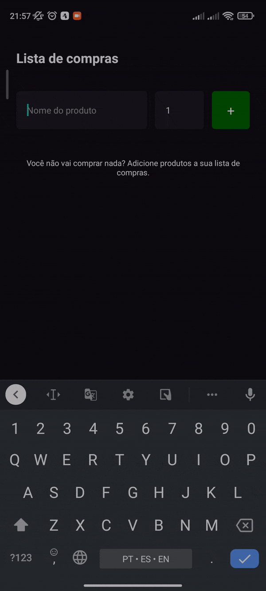

# Shop List

Project builded with React Native.

### Features:
 - Add products to list
 - Remove products from list
 - List products

### Future features:
 - Save a shop list
 - Add prices by products and compute total value

### Screenshot:
 - Screenshot showing off adding and removing list items



### Como testar o projeto?

Faça o clone do repositório:

```
git clone https://github.com/Cleidson-Oliveira/shoplist-reactnative.git
```

Entre na pasta que acabou de ser criada:

```
cd shoplist-reactnative
```

Instale as dependências:

```
yarn

or

npm install
```

Rodando o projeto:

```
yarn start

or

npm start
```

Utilize o Expo Go no smartphone ou emulador para visualizar a aplicação.
